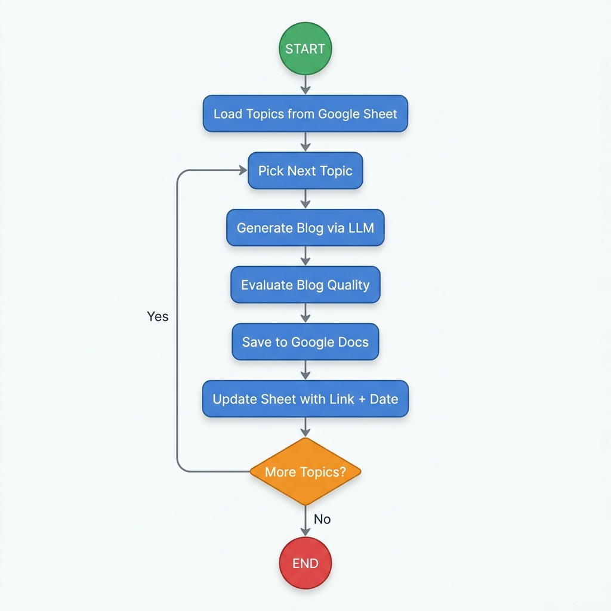

# 🤖 LangGraph Blog Automation Agent

An autonomous, cloud-based content generation agent built with **LangGraph**. It reads blog topics from a **Google Sheet**, drafts SEO-optimized articles using LLMs, evaluates content quality using a hybrid evaluator (Heuristics + LLM-as-a-Judge), publishes the articles to styled **Google Docs**, and updates the spreadsheet with the document link and execution date.

---

## 🔄 Pipeline Workflow

Here is how the agent processes your content pipeline:



---

## 🛠️ Features

- **Google Workspace Integration**: Seamlessly fetches inputs from Google Sheets and writes content directly to Google Docs.
- **Dynamic Headings Styling**: Converts raw markdown tags (`#`, `##`, `###`) into styled, native document headings in Google Docs.
- **Hybrid Content Evaluation**: Auto-rates every post on word counts, structure, and qualitative dimensions (SEO, coherence, actionability) using an LLM-as-a-Judge.
- **Background Watch Mode**: Can run continuously (`--watch` mode) to poll the Google Sheet and automate new entries instantly.
- **Error Resilience**: Wraps tasks individually to prevent pipeline crashes if a single row has an error.

---

## 📁 Repository Structure

```
AI_Agent/
├── main.py                  # CLI entry point (single run or --watch)
├── requirements.txt         # Package dependencies
├── README.md                # Documentation manual
├── agent_flow_diagram.png   # Pipeline flowchart
│
├── agent/                   # LangGraph orchestration
│   ├── state.py             # AgentState schema
│   ├── nodes.py             # Pipeline execution nodes
│   ├── graph.py             # Workflow graph construction
│   └── evaluator.py         # Heuristics & LLM-as-Judge
│
└── utils/                   # Workspace & LLM helpers
    ├── llm_factory.py       # Groq/Ollama wrapper
    ├── gdocs_handler.py     # Doc creation & Markdown parsing
    └── gsheets_handler.py   # Sheet readers & writers
```

---

## 🚀 Setup & Installation

### 1. Install Dependencies
Clone the repository, navigate to the folder, and install the required Python packages:
```bash
pip install -r requirements.txt
```

### 2. Google Cloud Console Configuration
The agent requires access to Docs, Drive, and Sheets APIs.
1. Go to the [Google Cloud Console](https://console.cloud.google.com/).
2. Create a project and enable these three APIs:
   - **Google Sheets API**
   - **Google Docs API**
   - **Google Drive API**
3. Configure the **OAuth Consent Screen**:
   - Set the User Type to **External**.
   - Under **Test Users**, add your Gmail address (required while the app is in testing mode).
4. Create Credentials:
   - Go to **Credentials** -> **Create Credentials** -> **OAuth client ID**.
   - Select **Desktop app** as the Application type.
   - Download the generated JSON credentials file.
   - Rename this file to `google_creds.json` and place it in your project's root folder.

### 3. Google Sheet Setup
1. Create a new Google Sheet with the following headers in Row 1:

| Category | Topic | Updated Date | Link |
|---|---|---|---|

2. Add a few blog ideas in the **Category** and **Topic** columns. Leave the **Updated Date** and **Link** columns blank.
3. Extract the **Spreadsheet ID** from the sheet's URL:
   `https://docs.google.com/spreadsheets/d/` **`YOUR_SPREADSHEET_ID`** `/edit`

### 4. Configure Environment Variables
Create a file named `.env` in the root directory:
```env
LLM_PROVIDER=groq
GROQ_API_KEY=your_groq_api_key_here
GROQ_MODEL=llama-3.1-8b-instant

# Google Sheets Configuration
GOOGLE_SHEET_ID=your_spreadsheet_id_here
GOOGLE_SHEET_RANGE=Sheet1!A:D
```

*(Optional: Set `LLM_PROVIDER=ollama` to run models locally using Ollama).*

---

## 💻 Running the Agent

### Single Execution
Processes all currently pending rows in the sheet, updates the links/dates, and exits:
```bash
python main.py
```

### Live Watch Mode
Listens for new entries in the sheet, checking for new rows every 60 seconds:
```bash
python main.py --watch
```
*Press `Ctrl+C` to terminate the loop.*

---

## 📊 Evaluation Mechanics
The evaluator (`agent/evaluator.py`) ensures generated content meets quality standards:
1. **Heuristics (Fast)**: Checks if word count is > 600, verifies ≥ 3 heading levels (`##`), and matches target topic keywords in the intro.
2. **LLM-as-a-Judge**: Evaluates readability, coherence, and actionability on a 1-5 scale, returning structured scores.

---

## 🔒 Security Note
Credential files (`google_creds.json`, `token.json`, and the `credentials/` folder) and your `.env` configuration are ignored by Git in `.gitignore` to prevent secret leaks.
